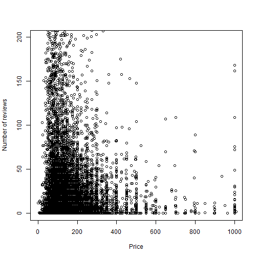

Shiny application Coursera Course
========================================================
author: Simone Bom
date: 13-12-2019
autosize: true


Goal of slides
========================================================

1. Must be done in Rstudio Presenter or Slidy
2. Must be 5 pages
3. Must be hosted on Github or Rpubs
4. Must contained some embedded R code that gets run when slidifying the document


Slide With Code
========================================================
The data set used for making the shiny application is a data set with the airbnb marktet in Madrid. The first column names are given in the overview below. 


```
 [1] "id"                             "name"                          
 [3] "host_id"                        "host_name"                     
 [5] "neighbourhood_group"            "neighbourhood"                 
 [7] "latitude"                       "longitude"                     
 [9] "room_type"                      "price"                         
[11] "minimum_nights"                 "number_of_reviews"             
[13] "last_review"                    "reviews_per_month"             
[15] "calculated_host_listings_count" "availability_365.."            
```

Slide With Plot
========================================================
Next we give a plot of the data with the number of reviews plotted against the price of the airbnb.



Shiny application 
========================================================
The links to the shiny application can be found on the following pages. 
